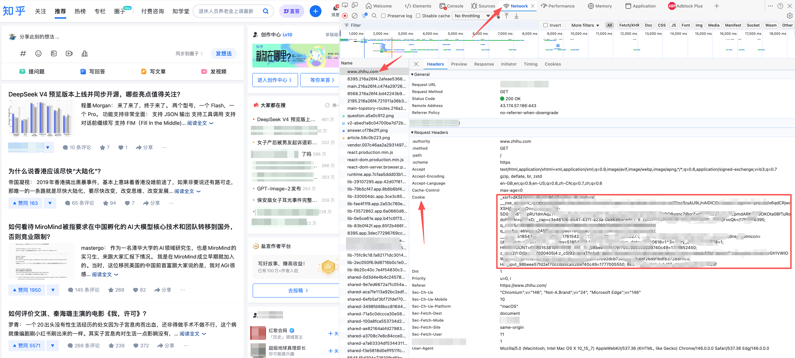

# marsggbo-skill

个人知乎内容抓取 + Claude Code 数字分身技能。

Forked from [floodsung/floodsung-skill](https://github.com/floodsung/floodsung-skill) — Option B 方式。

---

## 目录结构

```
marsggbo-skill/
  scripts/
    scraper.py          # 抓取知乎文章/想法/回答
    enrich.py           # 补全全文内容
    build_references.py # 生成 skill 参考文件
  data/
    zhihu/              # 爬取结果（运行后自动生成）
      articles.json/md
      pins.json/md
      answers.json/md
      summary.json

~/.claude/skills/marsggbo/
  SKILL.md              # Claude Code skill 定义（需完善）
  references/           # build_references.py 自动生成
    writing_style_examples.md
    core_views.md
    title_index.md
    search_zhihu.sh
```

---

## 使用步骤

### 第一步：安装依赖

```bash
pip install requests beautifulsoup4 markdownify lxml
```

### 第二步：获取知乎 Cookie

1. 浏览器登录 [zhihu.com](https://www.zhihu.com)
2. 打开开发者工具 → Network → 随便点一个 API 请求
3. 找到 Cookie 请求头，复制完整内容（需包含 `d_c0`、`z_c0`、`_xsrf`）
4. 导出环境变量：

```bash
export ZHIHU_COOKIE="d_c0=...; z_c0=...; _xsrf=..."
```

获取 Cookie 的方式参考下面截图步骤



### 第三步：抓取内容

```bash
cd ~/marsggbo-skill/scripts
USER_NAME="hexin_marsggbo"
python3 scraper.py --user $USER_NAME --out ../data/zhihu
```

输出示例：
```
=== articles ===
  article: 标题...
  ...
saved 42 articles → ../data/zhihu/articles.json

=== pins (想法) ===
  pin: 内容...
  ...

=== answers ===
  answer: 问题标题...
  ...

DONE: {'user': 'hexin_marsggbo', 'counts': {...}, 'scraped_at': '...'}
```

### 第四步：补全内容（可选）

如果文章正文不完整，运行 enrich：

```bash
python3 enrich.py --dir ../data/zhihu
```

### 第五步：生成 skill 参考文件

```bash
python3 build_references.py
```

会在 `~/.claude/skills/marsggbo/references/` 生成：
- `writing_style_examples.md` — 高赞文章开头样本
- `core_views.md` — 按主题聚合的核心观点
- `title_index.md` — 全量内容索引
- `search_zhihu.sh` — 关键词检索脚本

### 第六步：完善 SKILL.md

打开 `~/.claude/skills/marsggbo/SKILL.md`，参照 `references/` 里的内容：

1. 填写身份信息（职位/研究方向/所在机构/代表作）
2. 总结核心技术观点
3. 分析写作风格（参照 `writing_style_examples.md`）
4. 补充反模式

### 第七步：在 Claude Code 中使用

在 Claude Code 中直接使用 `/marsggbo` 命令触发 skill：

```
/marsggbo 帮我写一篇关于强化学习的知乎文章
```

或在对话中：
```
用我的风格写一条想法：今天读了一篇关于 VLA 的 paper，非常有感触
```

---

## 重新抓取

Cookie 有效期有限，内容更新时重新执行步骤 2-5：

```bash
export ZHIHU_COOKIE="新的 cookie"
USER_NAME="hexin_marsggbo"
python3 scraper.py --user $USER_NAME --out ../data/zhihu
python3 enrich.py --dir ../data/zhihu
python3 build_references.py
```
